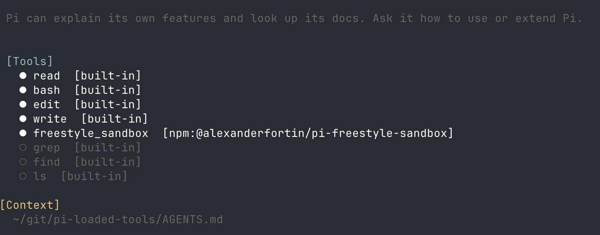

# pi-loaded-tools

[](https://codecov.io/gh/shaftoe/pi-loaded-tools)

[Pi coding agent](https://pi.dev) extension to list session's loaded tools.

Pi currently doesn't show this important information at startup nor elsewhere, installing this extension will show tools list at startup with active/inactive status and source labels, also prints the list on demand with `/tools` registered command.

## Example



## Install

### From npm

```bash
pi install npm:@alexanderfortin/pi-loaded-tools
```

### From github

```bash
pi install git:github.com/shaftoe/pi-loaded-tools
```

> [!NOTE]
> You might want to update `~/.pi/agent/settings.json` to ensure `pi-loaded-tools` is loaded last so to be able to show all available tools registered by other extensions too

## Usage

Run `/tools` inside a pi session to see the list of loaded tools.

```
/tools    # List all loaded tools with source provenance
```

## Releasing

This project uses automated publishing to NPM via GitHub Actions. The workflow will:

- Run all CI checks
- Build the package
- Publish to NPM with provenance (signed) via [trusted publishing](https://docs.npmjs.com/trusted-publishers)

## License

See [LICENSE](./LICENSE)
